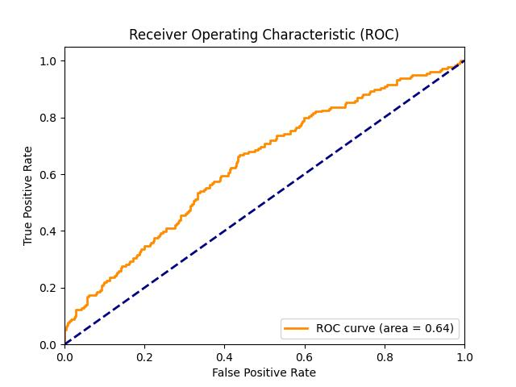

# Credibly Machine Learning

## AUC graphs

### **Baseline Model - XGBoost**


### 1. Imputation



### 2. 2-Stage Modeling


### 3. Ensembling


## Getting Started

### Prerequisites

- Python (v-3.10.4)
- Libraries: pandas, scikit-learn, xgboost, etc.

### Installation

1. Clone the repository:
```bash
git clone https://github.com/yihonghhe/Project_Creditbly.git
