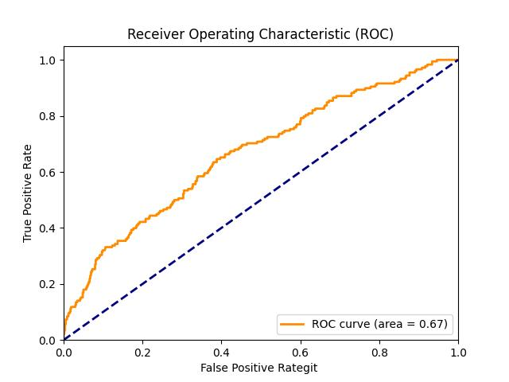

## Model Leaderboard

| Model                    | AUC Graph                                                    |
| ------------------------ | ------------------------------------------------------------ |
| Baseline Model - XGBoost |          |
| Imputation               |        |
| 2-Stage Modeling         |  |
| Ensembling               |               |

## Getting Started

### Prerequisites

- Python (v-3.10.4)
- Libraries: pandas, scikit-learn, xgboost, etc.

### Installation

1. Clone the repository:

```bash
git clone https://github.com/yihonghhe/Project_Creditbly.git
```
